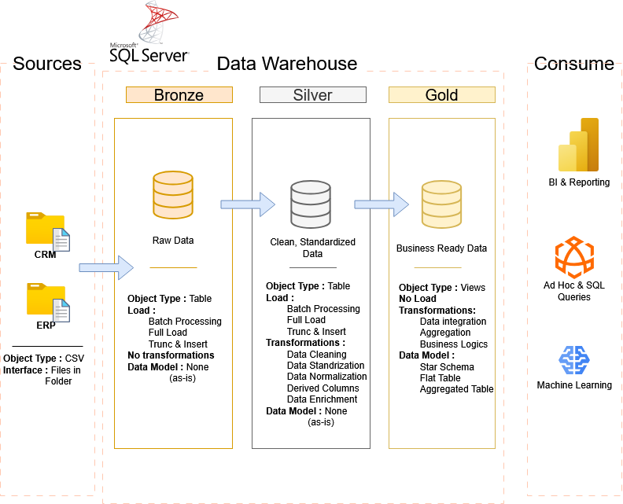

# sql-data-warehouse-project
Building a mordern data warehouse with SQL Server, including ETL processes, data modeling, and analytics.

---
Welcome to the Data Warehouse And Analytics Project repository! 🚀
This project demonstrates a comprehensive data warehousing and analytics solution, from building a data
warehouse to generating actionable insights. Designed as a portfolio project, it highlights industry best
practices in data engineering and analytics.

---
📒## Project Overview

This project involves:
  1- Data Architecture: Design a Mordern Data Warehouse Using Medallion Architecture Bronze, Silver, and
  Gold layers.
  2- ETL Pipelines: Extracting, transforming, and loading data from source systems into the warehouse.
  3- Data Modeling: Developing fact and dimension tables optimized for analytical queries.
  4- Analyics & Reporting: Creating SQL-based reports and dashboards for actionable insights.

---
## 🏗️ Data Architecture

The data architecture for this project follows Medallion Architecture **Bronze**, **Silver**, and **Gold** layers:

1. **Bronze Layer**: Stores raw data as-is from the source systems. Data is ingested from CSV Files into SQL Server Database.
2. **Silver Layer**: This layer includes data cleansing, standardization, and normalization processes to prepare data for analysis.
3. **Gold Layer**: Houses business-ready data modeled into a star schema required for reporting and analytics.

🎯This repository is an excellent resource for professionals and students looking to showcase expertise
in:
  - SQL Development
  - Data Architect
  - Data Engineering
  - ETL Pipeline Developer
  - Data Modeling
  - Data Analytics

---

⭐ ### About Me
---

Hi there! I am Harish Mahanta, an aspiring Data Engineer.
